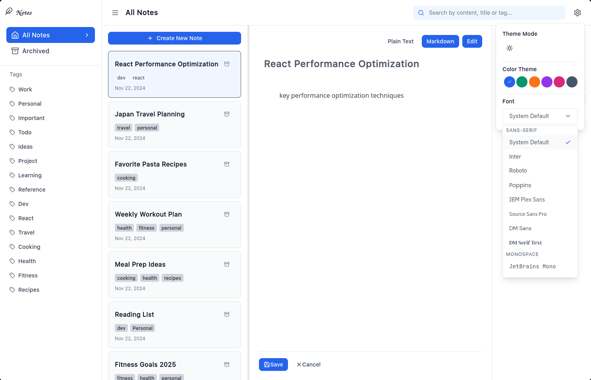

# Note App

[]()

A modern note-taking application built with React and TypeScript. Features a clean, minimalist design powered by Tailwind CSS.




## ✨ Key Features

- 📝 **Modern Tech Stack**
  - React with TypeScript
  - Tailwind CSS for styling
  - Vite for fast development
  - ESLint + Prettier for code quality

- 🏗️ **Project Structure**
  - Monorepo setup with pnpm workspaces
  - Shared packages for code reuse
  - Organized frontend architecture

## 🎯 Features

### Note Management
- Create, edit, and delete notes
- Rich text editor with formatting options
- Auto-save functionality
- Note archiving system
- Categories and tags for organization

### User Interface
- Clean, modern design
- Responsive layout with resizable panels
- Customizable themes (Light/Dark mode)
- Adjustable font settings
- Sidebar navigation

### Organization
- Tag-based note organization
- Category management
- Archive functionality
- List and detail views
- Quick actions menu

### Settings & Customization
- Theme customization
- Font size adjustment
- Layout preferences
- Sidebar toggle
- Panel size adjustment

## 🚀 Getting Started

### Prerequisites

- Node.js
- pnpm

### Installation

1. Clone the repository:

```bash
git clone https://github.com/yourusername/note-app.git
cd note-app
```

2. Install dependencies:

```bash
pnpm install
```

3. Start the development server:

```bash
pnpm dev
```

4. Open [http://localhost:5173](http://localhost:5173) in your browser.

## 🏗️ Tech Stack

- **Frontend:** React + TypeScript
- **Styling:** Tailwind CSS
- **Build Tool:** Vite
- **Package Manager:** pnpm
- **Code Quality:** ESLint + Prettier

## 📁 Project Structure

```
note-app/
├── apps/
│   └── frontend/           # Frontend application
│       ├── public/        # Static assets
│       ├── src/          # Source files
│       └── vite.config.ts # Vite configuration
├── packages/
│   └── shared/           # Shared utilities and components
├── .eslintrc.json       # ESLint configuration
├── .prettierrc          # Prettier configuration
├── package.json
├── pnpm-workspace.yaml
├── postcss.config.mjs
├── tailwind.config.mjs
└── tsconfig.base.json
```

## 🧑‍💻 Development

### Available Scripts

- `pnpm dev` - Start development server
- `pnpm build` - Build for production
- `pnpm lint` - Run ESLint
- `pnpm format` - Format code with Prettier
- `pnpm clean` - Clean build artifacts

### Coding Standards

- ESLint for code linting
- Prettier for code formatting
- TypeScript for type safety

## 📄 License

This project is open source and available under the MIT License.

---

Built with modern web technologies 🚀
